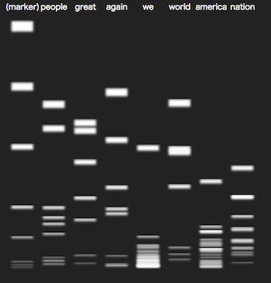

# d3-electrophoresis
A D3.js plugin to simulate electrophoresis which is a basic biotechnological technique to visualize length of DNA segments cut by restriction enzyme.
Using this plugin, you can cut not only DNA sequence, but also any text, by words.



### Examples
gistにあげ、blockのリンク、自分のブログでのDNA切り、CGなどのリンク。

### Install
npmかgithubのリリースへのリンク。scriptタグの例。d3v4と一緒に使う。
1. Download this plugin from 〜〜〜.
2. In HTML, load D3.js (__v.4__) and d3-electrophoresis.js with `<script>`tags.

```
<script src="https://cdnjs.cloudflare.com/ajax/libs/d3/4.5.0/d3.min.js" charset="utf-8"></script>
<script src="d3-electrophoresis.js"></script>
```

### Basic Usage
```js
var gel = electrophoresis();

var svg = d3.select("body").append("svg")
  .attr("width", 460)
  .attr("height", 500)
  .call(gel.makeGel); // Make black background first.

var text = "AGCGCCCAATACGCAAACCGCCTCTCCCCGCGCGTTGGCCGATTCACGTTTACGAGTTGGAAACGA";
var words = [[1,5,10,15,20,30,40,50,70,100],"CAAA","GTTGG","GGATCC", "GA",["GT","CCT"],"ACC", "GAAA"];
var names = ["marker", "1", "2", "3", "4", "5", "6", "7"];
// You can set every parameter by dictionary or method-chain. Example: {DNA: text} or .DNA(text).
gel = electrophoresis().DNA(text).enzymes(words).names(names);
svg.call(gel);
```

### Parameters
You can set every parameter by dictionary input:
```js
var gel  = electrophoresis({DNA:"agtctatcacg", enzymes:["ac","gca"]});
```
__and/or__ by method-chain:
```js
var gel = electrophoresis().DNA("agtctatcacg").enzymes(["ac","gca"]);
```


### API Reference
<a name="DNA" href="#DNA">#</a> electrophoresis.__DNA__([_text_])

Target text to be cut.

Default: _"AGCGCCCAATACGCAAACCGCCTCTCCCCGCGCGTTGGCCGATTCACGTTTACGAGTTGGAAACGA"_.

<a name="enzymes" href="#enzymes">#</a> electrophoresis.__enzymes__([_list_])

Word list to cut target text.

When the word list includes a number list as a element, (e.g. _["AC",[10,15,20]]_), the numbers are directly used as resulted length of cut segmented text without cutting text. When the word list includes a word list as a element, (e.g. _["AC",["GT","CCT"]]_), target text is cut by both of the two words all together.

Default: _[[1,5,10,15,20,30,40,50,70,100],"CAAA","GTTGG","GGATCC", "GA",["GT","CCT"],"ACC", "GAAA"]_.

<a name="names" href="#names">#</a> electrophoresis.__names__([_list_])

Name list of enzymes. They appear as tooltips on each resulted lane.

Default: _["marker", "1", "2", "3", "4", "5", "6", "7"]_.

<a name="scale" href="#scale">#</a> electrophoresis.__scale__([_obj_])

A scale to map length values of segmented texts from top to the bottom. This must be a scale object in D3-v.4 syntax, such as `d3.scaleSqrt()`.

Default: _`d3.scaleLinear()`_.

<a name="lane_number" href="#lane_number">#</a> electrophoresis.__lane_number__([_int_])

Max number of lanes.

Default: _8_.

<a name="gel_margin" href="#gel_margin">#</a> electrophoresis.__gel_margin__([_dict_])

Margin size from edges of background.

Default: _{top: 40, right: 20, bottom: 30, left: 20}_.

<a name="duration" href="#duration">#</a> electrophoresis.__duration__([_float_])

Time to finish animation.

Default: _6000_.

<a name="band_width" href="#band_width">#</a> electrophoresis.__band_width__([_float_])

Width of bands.

Default: _38_.

<a name="band_blur" href="#band_blur">#</a> electrophoresis.__band_blur__([_float_])

Blur of bands.

Default: _2_.

<a name="band_thick_min" href="#band_thick_min">#</a> electrophoresis.__band_thick_min__([_float_])

Minimum thickness of bands.

Default: _1_.

<a name="band_thick_rate" href="#band_thick_rate">#</a> electrophoresis.__band_thick_rate__([_float_])

How bands turns less thick as the bands go down.

Default: _0.04_

<a name="tooltip_name_on" href="#tooltip_name_on">#</a> electrophoresis.__tooltip_name_on__([_str_])

"on" or "off" for tooltips of enzyme name on upper side.

Default: _"on"_.

<a name="tooltip_name_size" href="#tooltip_name_size">#</a> electrophoresis.__tooltip_name_size__([_float_])

Size of name tooltips.

Default: _17_.

<a name="tooltip_name_offsetX" href="#tooltip_name_offsetX">#</a> electrophoresis.__tooltip_name_offsetX__([_float_])

Horizontal offset of name tooltips.

Default: _0_.

<a name="tooltip_name_offsetY" href="#tooltip_name_offsetY">#</a> electrophoresis.__tooltip_name_offsetY__([_float_])

Vertical Offset of name tooltips.

Default: _20_.

<a name="tooltip_band_on" href="#tooltip_band_on">#</a> electrophoresis.__tooltip_band_on__([_str_])

"on" or "off" for tooltips of band length.

Default: _"on"_;

<a name="tooltip_band_size" href="#tooltip_band_size">#</a> electrophoresis.__tooltip_band_size__([_float_])

size of band tooltips.

Default: _13_.

<a name="tooltip_band_offsetX" href="#tooltip_band_offsetX">#</a> electrophoresis.__tooltip_band_offsetX__([_float_])

Horizontal offset of band tooltips.

Default: _0_.

<a name="tooltip_band_offsetY" href="#tooltip_band_offsetY">#</a> electrophoresis.__tooltip_band_offsetY__([_float_])

Vertical offset of band tooltips.

Default: _0_.
